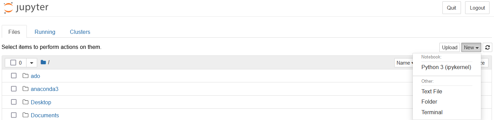

# 安装Anaconda

为什么用anaconda？

- 可能是最方便的安装方法了

为什么用Jupyter Notebook？

- 交互式的输入，方便调试程序

1. 打开anaconda的网站下载合适的版本即可

   > https://www.anaconda.com/

2. 安装完成后打开Jupyter Notebook（会跳转到浏览器）即可开始编程

   
   
3. Jupyter Notebook怎么用？

   * 代码块cell
   
   * 运行代码块
   
     `ctrl` + `enter`，`alt` + `enter`
   
   * 快捷键
   
     `a`，`b`，`d` `d`
   
   * 代码补全
   
     `tab`

*参考文献：*

> https://zhuanlan.zhihu.com/p/32925500

## （可选）更好的界面、更好的代码补全—— VS Code

1. 安装vscode

   > https://code.visualstudio.com/

2. 安装扩展

3. 使用文档

   > https://code.visualstudio.com/docs/datascience/jupyter-notebooks

*参考文献：*

> https://cloud.tencent.com/developer/article/1597211

# （可选）Git, GitHub

为什么用Git进行版本管理、协作？

* 对文本类型的文件支持很好
  * 文本类型：.do, .tex, .py, .ipynb …… 使用记事本打开不会乱码的格式
  * 非文本类型: .docx, .pdf ……
* 比较各个版本之间的不同
* 使用fork、pull request实现协作

1. 在https://github.com/上注册账号（可能需要科学上网？）

2. 下载GitHub Desktop（可能是最方便的）

   > https://desktop.github.com/

   登陆第1步注册的账号

3. https://github.com/luowenjie1/Group-of-Learning-Python

   * Clone: 相当于把仓库下载到电脑本地
   * Fork：相当于复制这个仓库到自己的GitHub仓库 **（推荐）**

4. 在电脑上增加修改内容

5. commit & pull request

*参考文献：*

> 这本书介绍了Git的原理和更多的操作：《GitHub入门与实践》
>
> * https://book.douban.com/subject/26462816/
>
> * https://github.com/richardwei195/eBooks/blob/master/Git/GitHub%E5%85%A5%E9%97%A8%E4%B8%8E%E5%AE%9E%E8%B7%B5.pdf

